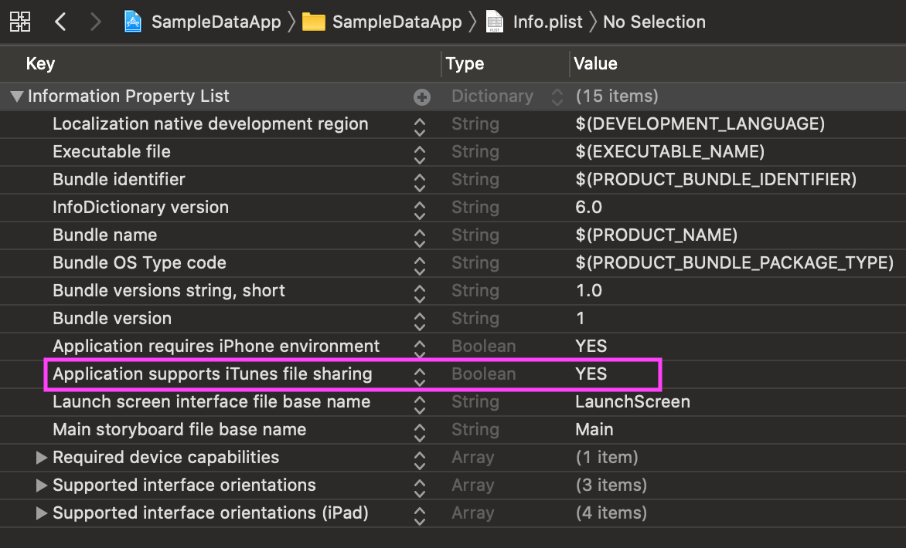
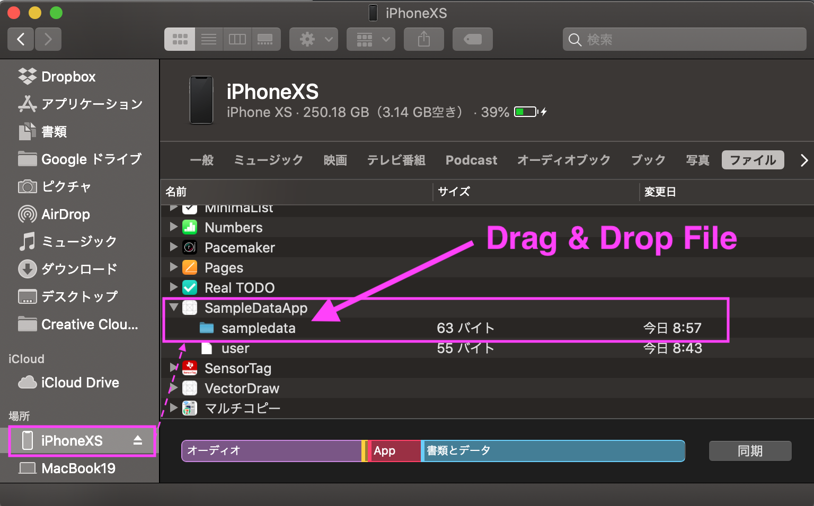

SampleData
===

***Sample data importer written by Swift.***

# Install

Copy [SampleData.swift](https://github.com/HituziANDO/SampleData/blob/master/SampleDataApp/Util/SampleData.swift) file to your project.

# Usage

## Get Started

1. Add `Application supports iTunes file sharing` property to your Info.plist
	
	|Key|Type|Value|
	|:-:|:-:|:-:|
	|Application supports iTunes file sharing|Boolean|YES|
	
	
	
	Apps with this property set to YES will be able to see the app's Documents directory from the Finder on macOS 10.15+ when the Mac PC and iOS device are connected with a cable.
	
1. Drag and drop a sample data as JSON file to the **sampledata** directory
	
	
		
	For example, use below JSON as user.json file to import the User data.
	
	```json:user.json
	{
	    "name": "Brad Pitt",
	    "country": "USA",
	    "age": 55
	}
	```
	
	On Finder, drag and drop user.json to the **sampledata** directory of your app in the iOS device.
	
1. 	Import the sample data
	
	Implement User struct conforms to Codable protocol.
	
	```swift:User.swift
	struct User: Codable {
	    var name    = ""
	    var country = ""
	    var age     = 0
	}
	```
	
	Import the User data using **SampleData** class.
	
	```swift
	if let user = SampleData.default.import(dataOfFile: "user.json", ofType: User.self) {
	    textView.text = """
	                    User:
	                        name: \(user.name)
	                        country: \(user.country)
	                        age: \(user.age)
	                    """
	}
	```
	
## Lock Option

Prevents duplicate data reading when you use the lock option. You give true to `lock` argument of `import` method.

```swift
if let user = SampleData.default.import(dataOfFile: "user.json", ofType: User.self, lock: true) {
    // TODO: something
}
```

## Unlock File

Unlocks a locked file for preventing duplicate data reading.

```swift
SampleData.default.unlock("user.json")
```

## Clean

Deletes all sample data files and lock files in the datasample directory.

```swift
SampleData.default.clean()
```

## DryRun Mode

When the dry-run mode is enabled, all the SampleData's methods are ignored on running. You set true to `dryRun` class property of the SampleData class if using this mode.

```swift
#if !DEBUG
SampleData.dryRun = true
#endif
```

## Export Data

Creates a sample data as JSON file into the sampledata directory. Given `data` object needs to conform to Encodable protocol.

```swift
let user = User(name: "Anne Hathaway",
                country: "USA",
                age: 37)
if SampleData.default.export(data: user, to: "owner.json") {
    // TODO: success
}
```

# License

```
MIT License

Copyright (c) 2019-present Hituzi Ando

Permission is hereby granted, free of charge, to any person obtaining a copy
of this software and associated documentation files (the "Software"), to deal
in the Software without restriction, including without limitation the rights
to use, copy, modify, merge, publish, distribute, sublicense, and/or sell
copies of the Software, and to permit persons to whom the Software is
furnished to do so, subject to the following conditions:

The above copyright notice and this permission notice shall be included in all
copies or substantial portions of the Software.

THE SOFTWARE IS PROVIDED "AS IS", WITHOUT WARRANTY OF ANY KIND, EXPRESS OR
IMPLIED, INCLUDING BUT NOT LIMITED TO THE WARRANTIES OF MERCHANTABILITY,
FITNESS FOR A PARTICULAR PURPOSE AND NONINFRINGEMENT. IN NO EVENT SHALL THE
AUTHORS OR COPYRIGHT HOLDERS BE LIABLE FOR ANY CLAIM, DAMAGES OR OTHER
LIABILITY, WHETHER IN AN ACTION OF CONTRACT, TORT OR OTHERWISE, ARISING FROM,
OUT OF OR IN CONNECTION WITH THE SOFTWARE OR THE USE OR OTHER DEALINGS IN THE
SOFTWARE.
```